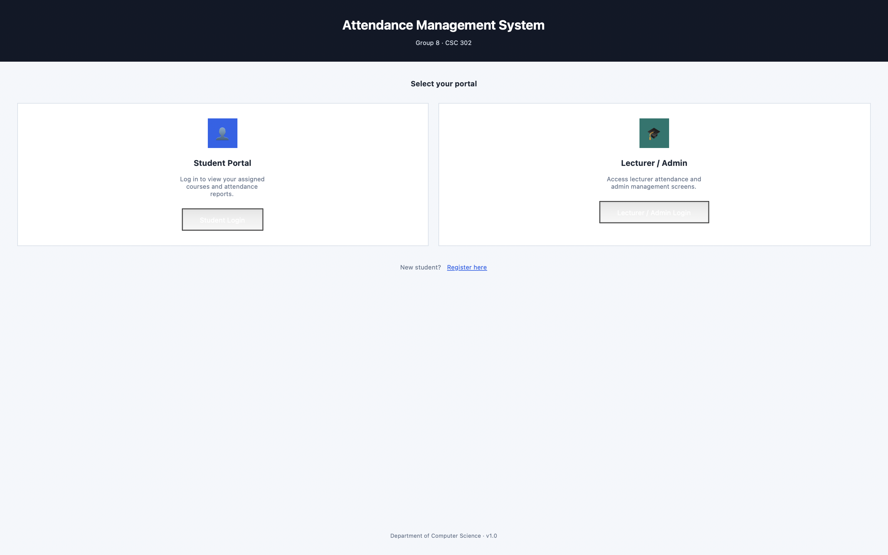
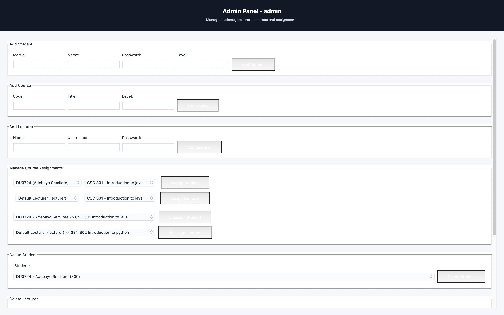
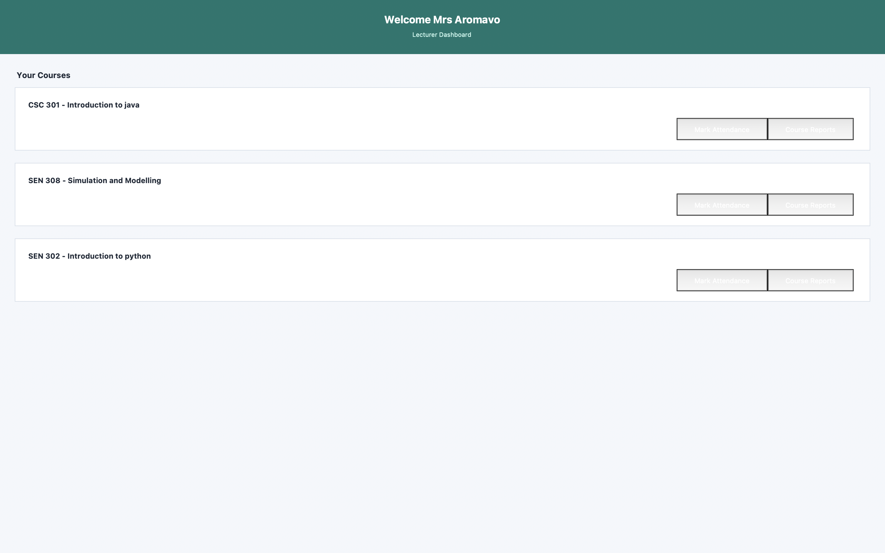
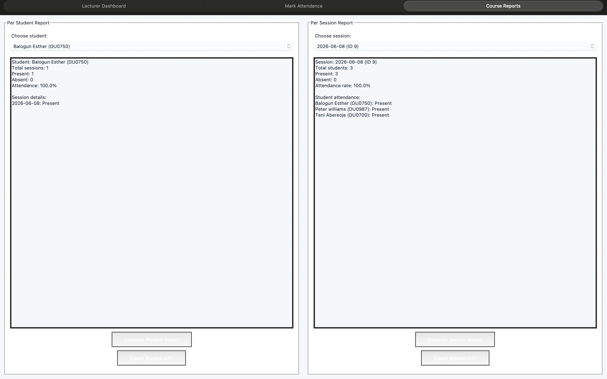
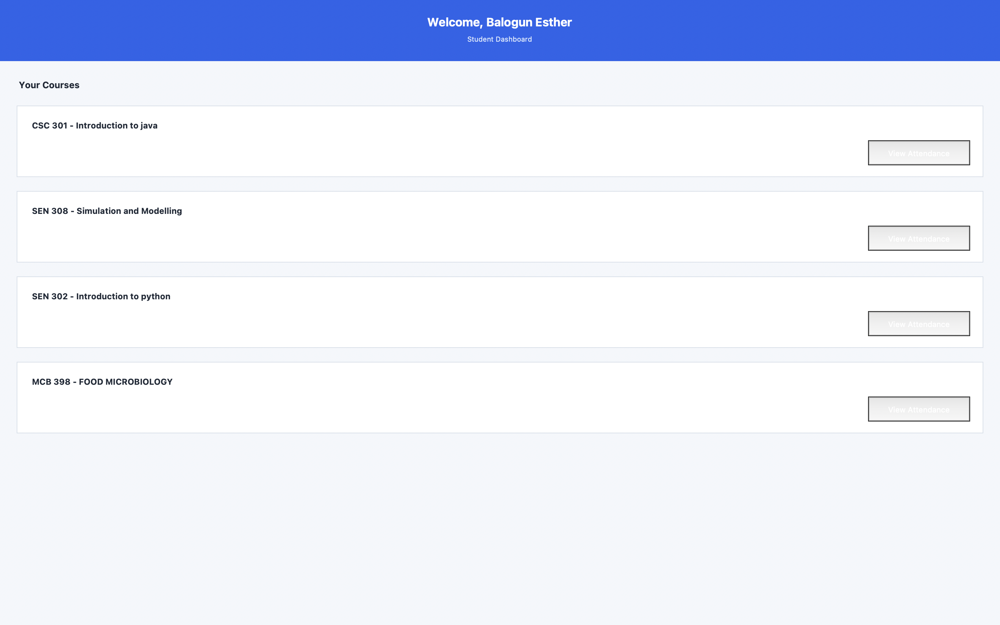
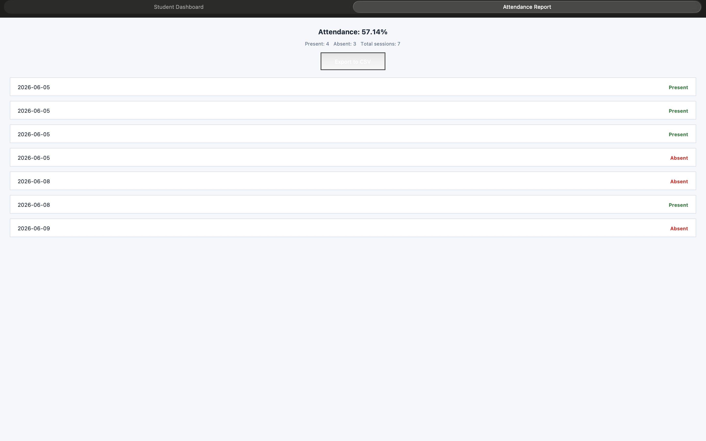

#  Attendance Management System (Tkinter + SQLite)


A desktop-based Attendance Management System built using **Python (Tkinter)** and **SQLite**.  
It provides a structured, role-based platform for managing student attendance in academic environments.

---

##  Key Features

-  Secure role-based authentication (Admin, Lecturer, Student)
-  Student attendance tracking and record management
-  Lecturer dashboard for marking and managing attendance
-  Admin control panel for system oversight
-  SQLite database for persistent data storage
-  Modular and scalable architecture
-  Clean and intuitive Tkinter GUI
-  Export utilities for attendance reports

---

##  System Architecture

The project follows a modular MVC-inspired structure:

- **UI Layer (Tkinter):** Handles all user interactions  
- **Logic Layer (Python):** Authentication, workflows, validation  
- **Data Layer (SQLite):** Stores users, attendance records, and reports  

---

##  Tech Stack

- Python (Core Logic)
- Tkinter (GUI Framework)
- SQLite (Database)

---

##  Project Structure

```text
main.py              → Entry point
auth.py              → Authentication system
db.py                → Database setup & queries
admin_ui.py          → Admin dashboard
lecturer_ui.py       → Lecturer dashboard
student_ui.py        → Student dashboard
ui_theme.py          → UI styling system
export_utils.py      → Export functionality
```

---

##  Screenshots

###  Login / Authentication
*(Add login.png if available)*


---

###  Admin Dashboard


---

### Lecturer Interface


---

###  Lecturer Reports


---

###  Student View


---

###  Student Reports


---

##  Installation & Setup

### 1. Clone repository
```bash
git clone https://github.com/herRebecca/attendance-system.git
```

### 2. Navigate into project
```bash
cd attendance-system
```

### 3. Run the app
```bash
python main.py
```

---

##  Use Case

This system is designed for academic institutions to:

- Track student attendance efficiently  
- Reduce manual record-keeping  
- Improve data accuracy  
- Support role-based academic workflows  

---

##  What I Learned

- Desktop application development with Tkinter  
- Database design with SQLite  
- Modular software architecture  
- Real-world system design and workflow management  
- Full application lifecycle development  

---

##  Future Improvements

-  Web version using React + Express.js  
-  Cloud database integration  
-  Mobile-friendly interface  
-  Analytics dashboard for attendance insights  
-  QR-code based attendance system  

---

##  Author

**Esther Balogun**  
GitHub: https://github.com/herRebecca  
Project: Attendance Management System

---

##  License

This project is for educational and portfolio purposes.

---

If you found this project useful, consider starring the repository!